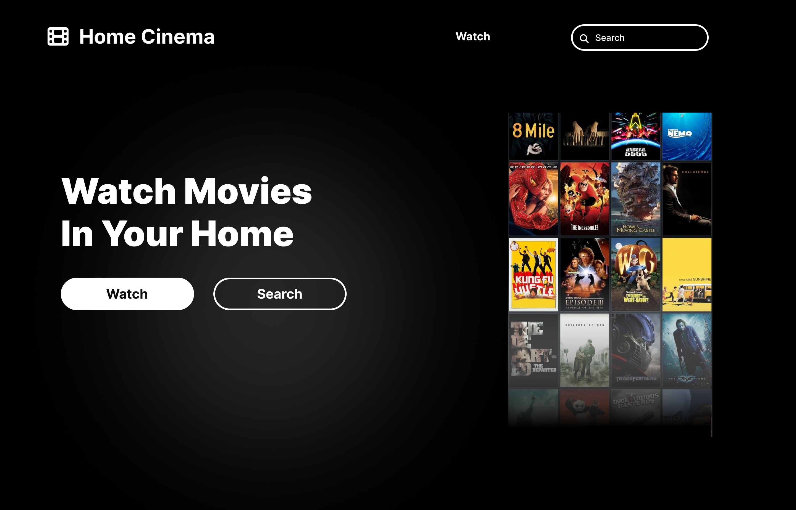

## Home Cinema

A website for browsing movie lists and information. it uses [YTS](https://yts.mx/) API and [Torrent Streamer Api](https://github.com/KHLALA-Gh/torrent-streamer-api), built with [Vite](https://vite.dev/) and [React](https://react.dev/)



### Setup

#### Docker (Recommended) :

You can use Home Cinema Docker images to run the application with Docker Compose.
First create `docker-compose.yml` file in the location you want and add the content below.

```yml
services:
  backend:
    image: khlala/torrent-streamer-api:alpha1
    # image: khlala/torrent-streamer-api:alpha1-arm64  ## use this image if you are running on arm64 arch
    ports:
      # You can choose the port you want
      - "8080:8080"
    restart: always
    volumes:
      - ./config/torrent_streamer_config.json:/etc/torrent_streamer_config
  home-cinema-website:
    image: khlala/home-cinema-web:alpha2
    # image: khlala/home-cinema-web:alpha2-arm64  ## use this image if you are running on arm64 arch
    ports:
      - "8000:4173"
    volumes:
      - ./config/home_cinema_config.json:/app/dist/home_cinema_config.json
    restart: always
```

> **Note** : Home cinema is still in alpha versions, you may encounter difficulties when installing it.

In the directory you created docker-compose.yml, make a new directory and name it `config` .
In the config directory create a file named `home_cinema_config.json` and write the configuration below

```json
{
  "torrent-streamer-api": {
    "origin": "http://localhost:8080"
  }
}
```

- If you are running the application on your local pc it will be http://localhost:8080
- Make sure you use the same port declared in the docker-compose.yml file.
- If the origin is incorrect, the client browser will send requests to the wrong address.
- If you will use the application from other devices in your local network or even in the internet make sure you set an ip address instead of http://localhost

You can add nginx service to docker-compose if you want better management **(optional)**.

```yml
services:
  # ...
  nginx:
    image: nginx:alpine
    ports:
      - "80:80"
    volumes:
      - ./config/nginx.conf:/etc/nginx/nginx.conf
    restart: always
    depends_on:
      - backend
      - home-cinema-website
```

To configure Nginx add `nginx.conf` file in the `./config` directory then configure your server.

To run the application execute this command :

```shell
docker compose up
```
