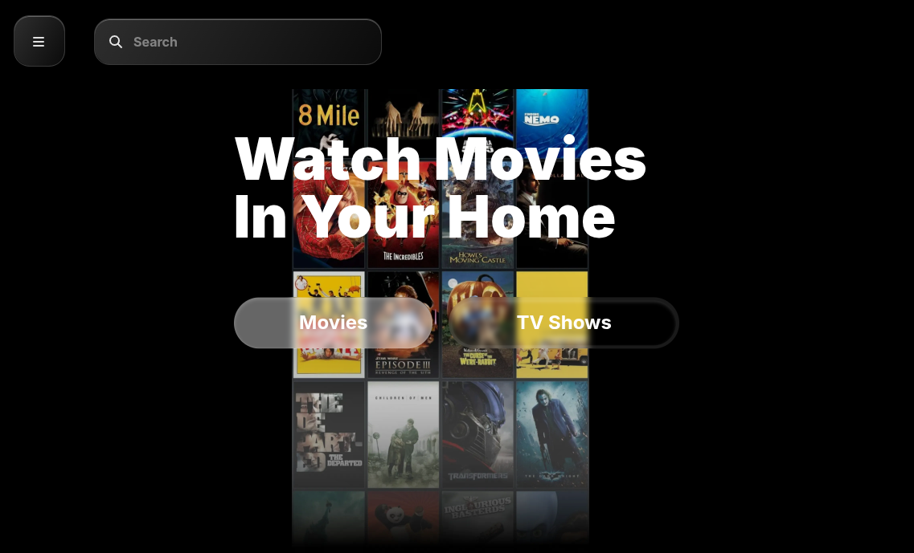

## Home Cinema

The website server for [HomeCinema desktop app](https://github.com/KHLALA-Gh/HomeCinema-Desktop).

A website for browsing movies and TV series. it uses [YTS](https://yts.mx/) and [Torrentio](https://torrentio.org/) APIs for finding torrents and [Torrent Streamer Api](https://github.com/KHLALA-Gh/torrent-streamer-api) for torrent streaming, built with [Vite](https://vite.dev/) and [React](https://react.dev/).



### Setup

#### Install package

```bash
npm i @home-cinema/app
```

#### Run the server

```js
import { bootServer } from "@home-cinema/app";

const PORT = 8080;

// starts the app server
bootServer(PORT, {
  desktopMode: true,
});
```

> note : The website is designed to work with Electron so that all functionalities are operational without problems.<br>
> The application requires IPC handlers to perform certain actions.<br>
> For more info see [HomeCinema-Desktop](https://github.com/KHLALA-Gh/HomeCinema-Desktop) source code.

### Issues

If you encounter any issues using the website don't hesitate to submit an [issue](https://github.com/KHLALA-Gh/HomeCinemaWebsite/issues)
